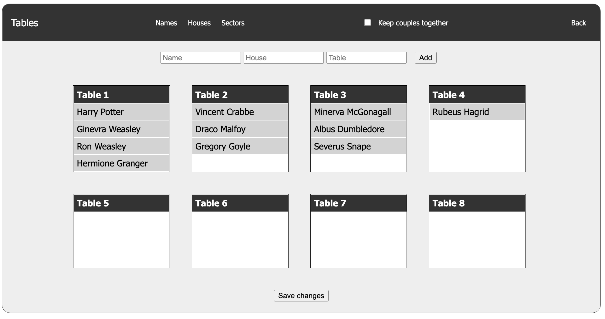

# Event Planner App

### This project is still in progress
Current page is just one part of a bigger event planner app I'm planning to build

Current features:
* read data from JSON file (temporary solution)
* populate tables with guests
* re-arrange sitting plan by drag-and-dropping guests
* add new guests to the tables

Future features:
Short term:
* read from/save to local storage
* use Vue/React

Long term:
* build back-end in Django
* use sqlite3 database
* implement other parts of the app (tbc.)