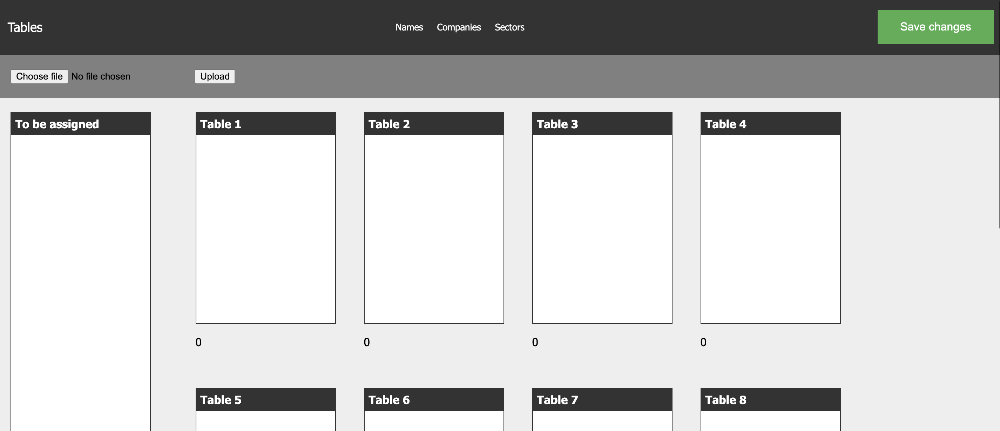

# Seating planner app

### It's a very pragmatic app that will help my team plan table arrangements at big events

Current features:

- upload data from an xlsx file
- upload data to local storage
- populate tables with guests
- re-arrange sitting plan by drag-and-dropping guests
- switch view to show other info than names (e.g., Company, Sector)
- notify when sitting arrangement exceeds table's capacity

